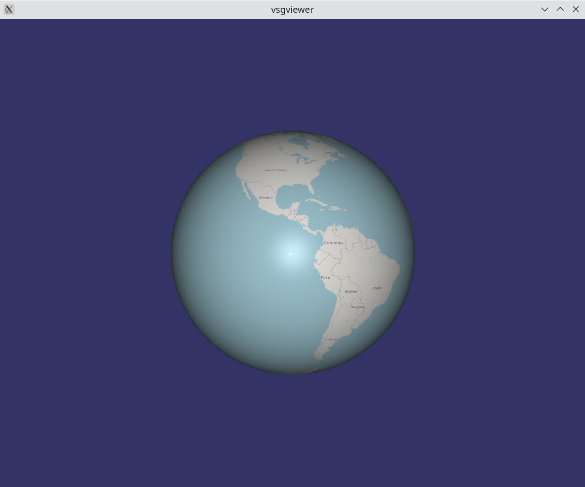
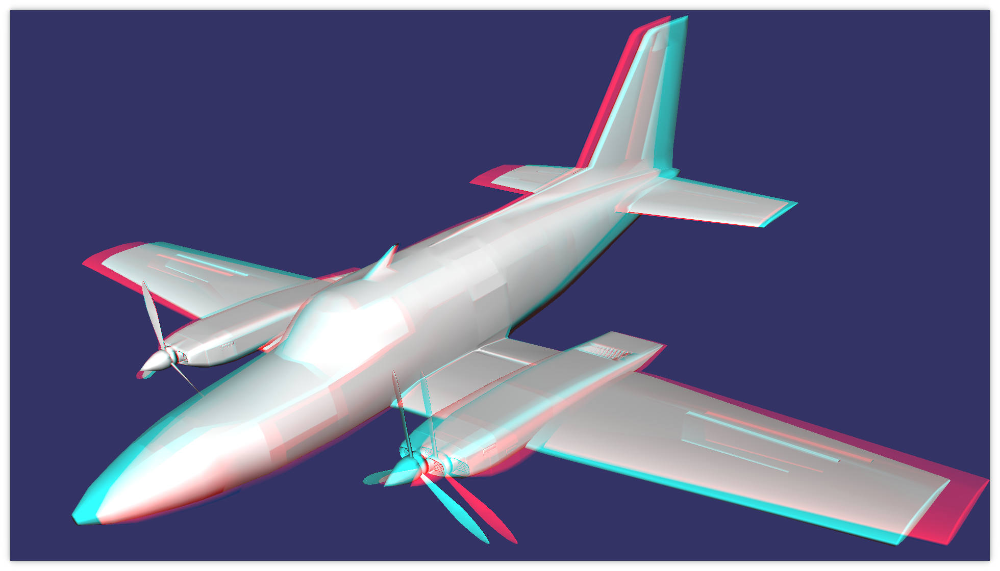
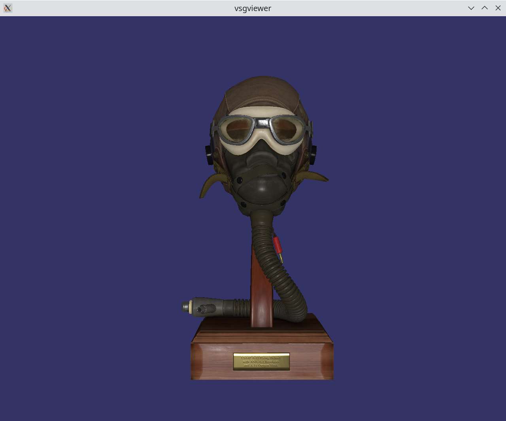
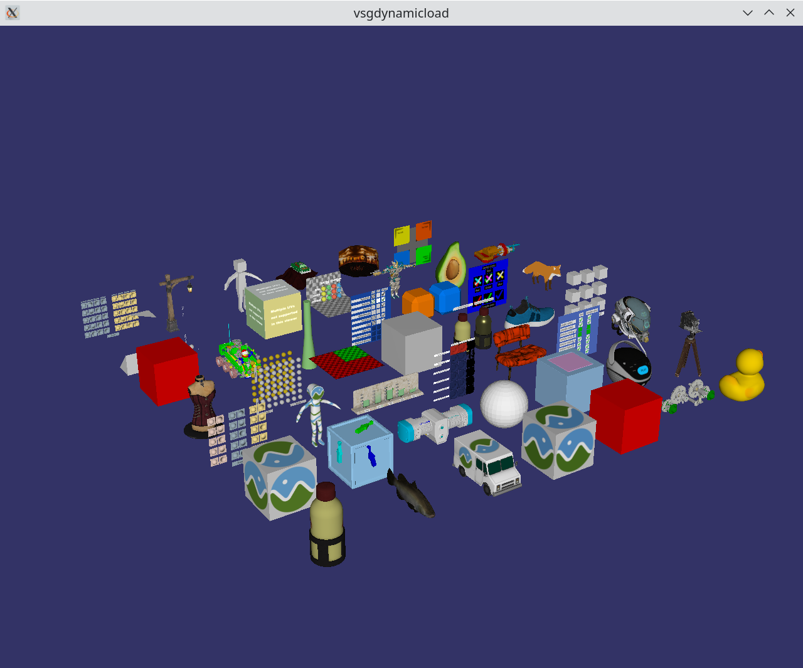
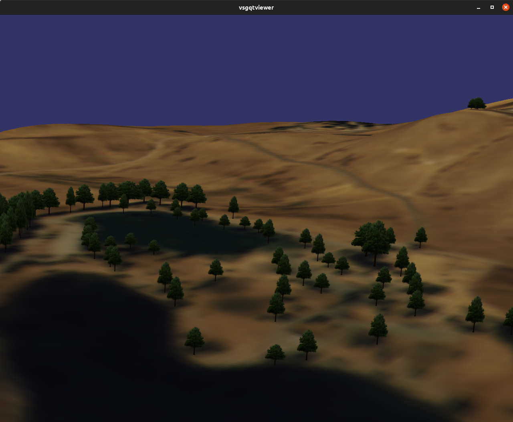
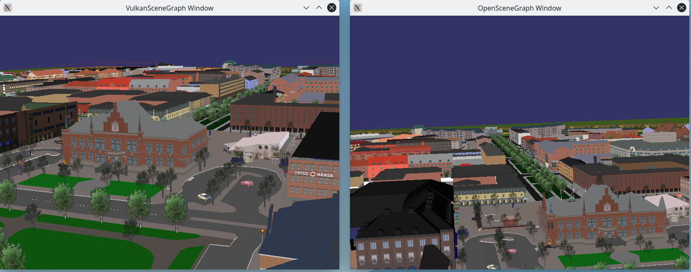
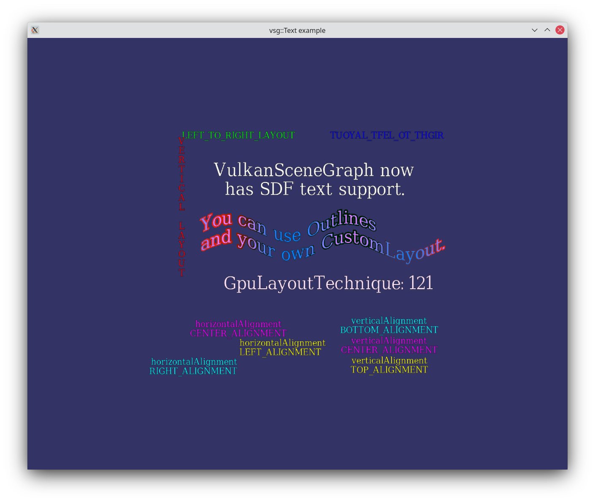
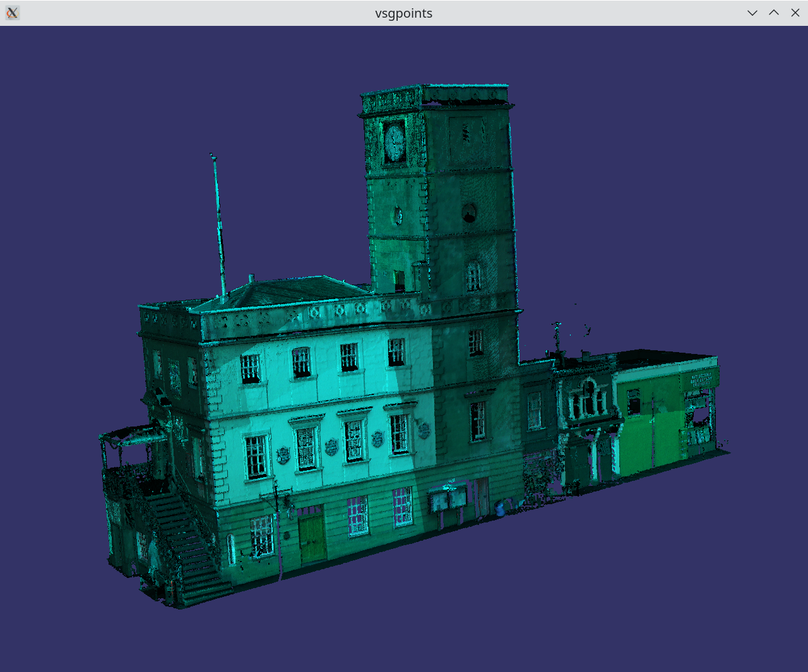
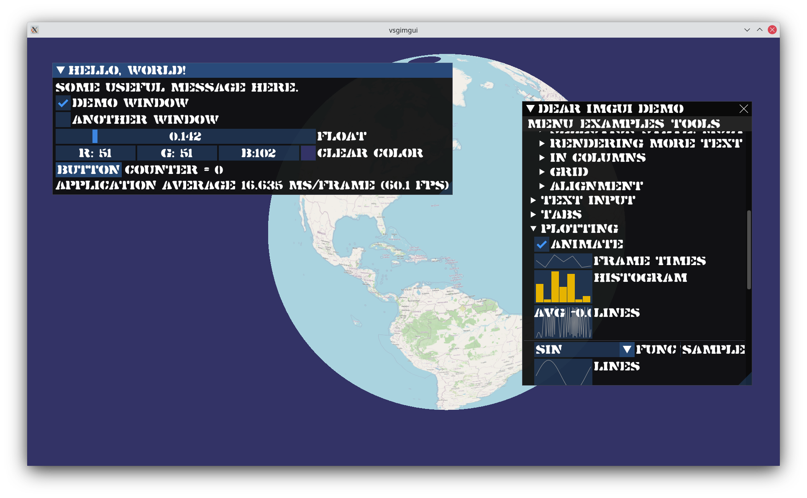
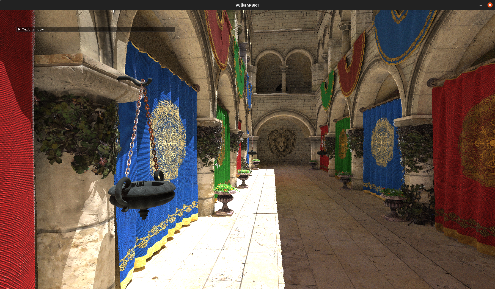

[screenshots directory](screenshots/)

Small town in the Trossachs, Scotland - where VulkanSceneGraph is developed, rendering using vsgCS

OpenSteetMaps imagery rendered using vsg::TileDatabase node

OpenSteetMaps imagery rendered using vsg::TileDatabase node

BingMaps imagery rendered using vsg::TileDatabase node

Multi CPU supported illustrated on 3 Geforece 1650 cards rendering an OpenFlight model of Umea, Sweeden

Multi-pass rendering used to render an anaglyphic stereo effect

Multi-pass rendering used to render stereo imagery

GLTF model loading provide by by vsgXchange::assimp loader with the VulkanSceneGrpah's builtin Physics Based Rendering shaders

Multi-thread loading example illustrates loading & rendering of the [glTF-Sample-Models](https://github.com/KhronosGroup/glTF-Sample-Models) sample set

Simple OpenSceneGraph lanading zone model loaded using osg2vsg/vsgXchange and rendering in a Qt window using vsgQt

Rendering of an OpenFlight model concunrrently in both OpenSceneGraph and VulkanSceneGraph within the same application

Example of rendering high quality SDF text

Rendering of point data clound using vsgPoints

Illustrates of vsgImGui integration with ImGui with custom font

Screenshot from VulkanPBRT - implementation of Ray Tracing using VulkanSceneGarph

